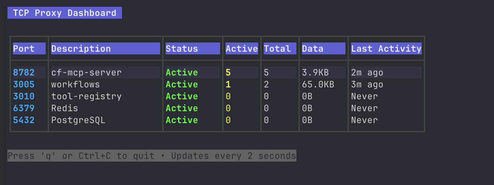

# TCP Proxy



A simple TCP proxy tool in Go that supports both forward and reverse proxy modes, with automatic configuration file support and a beautiful TUI dashboard.

## Usage

### Auto Mode with TUI (Recommended)
Use a `.proxy.conf` file to automatically set up multiple proxies with a beautiful dashboard:

**Auto Forward Mode** (run on client):
```bash
proxy                    # TUI dashboard (default)
proxy --headless         # No TUI (background mode)
proxy forward            # TUI dashboard (explicit)
proxy forward --headless # No TUI (background mode)
```

**Auto Reverse Mode** (run on server):
```bash
proxy reverse            # TUI dashboard (default)
proxy reverse --headless # No TUI (background mode)
proxy r                  # TUI dashboard (shorthand)
proxy r --headless       # No TUI (background mode)
```

### Manual Mode
**Forward Mode** - Forward localhost connections to remote servers:
```bash
proxy forward [remote]:[port] [localPort]
```

**Reverse Mode** - Expose localhost services on all network interfaces:
```bash
proxy reverse [localPort] [externalPort]
proxy r [localPort] [externalPort]          # shorthand
```

## Configuration File

Create a `.proxy.conf` file in your project directory:

```
# Proxy Configuration
# Format: port:description (optional)
# Lines starting with # are comments

# Web development
3000:React dev server
8080:API server
8782:Backend service

# Database connections
5432:PostgreSQL
6379:Redis

# Other services
9000:Grafana
8000:Django
```

## Examples

### Using Config File (Recommended Workflow)

1. **On your server (work-mbp):**
   ```bash
   # Create config file in your project
   echo "8782:Backend API" > .proxy.conf
   
   # Start reverse proxy with TUI dashboard
   ./proxy reverse
   
   # Or run in background without TUI
   ./proxy reverse --headless
   ```

2. **On your client machine:**
   ```bash
   # Set remote host environment variable
   export PROXY_REMOTE_HOST=work-mbp.tailnet.ts.net
   
   # Start forward proxy with TUI dashboard (default behavior)
   ./proxy
   
   # Or run in background without TUI
   ./proxy --headless
   ```

3. **Now you can access your remote service locally:**
   ```bash
   curl localhost:8782  # Actually connects to work-mbp:8782
   ```

### Manual Mode Examples

**Forward Mode:**
```bash
./proxy forward myserver.tailnet.ts.net:8080 3000
```

**Reverse Mode:**
```bash
./proxy reverse 8080 8080
./proxy r 8080 8080        # shorthand
```

### Help and Documentation

**Get help:**
```bash
./proxy --help                # General help
./proxy forward --help        # Forward mode help
./proxy reverse --help        # Reverse mode help
```

## Installation

### Download Pre-built Binaries

Download the latest release from the [GitHub releases page](https://github.com/your-username/proxy/releases).

Available for:
- Linux (x64, ARM64)
- macOS (Intel, Apple Silicon)
- Windows (x64, ARM64)

### Build from Source

```bash
git clone https://github.com/your-username/proxy.git
cd proxy
go build -o proxy .
```

### Using Make

```bash
make build          # Build for current platform
make linux          # Build for Linux
make darwin          # Build for macOS
make windows         # Build for Windows
make all             # Build for all platforms
```

## Features

- 🖥️ **Beautiful TUI Dashboard**: Real-time monitoring with professional table formatting
- 🔄 **Forward & Reverse Modes**: Connect localhost to remote services or expose services to network
- 📝 **Config File Support**: Automatically handle multiple ports via `.proxy.conf`
- 📊 **Connection Statistics**: Track active connections, total connections, and data transferred
- 🚀 **Concurrent Proxies**: Handle multiple services simultaneously
- 🎯 **TUI-First Design**: Beautiful interface by default, `--headless` for background mode
- 🪶 **Lightweight**: Minimal dependencies, modular design
- 🛡️ **Error Handling**: Comprehensive error reporting and graceful degradation

## How it works

### Forward Mode
1. Tests connectivity to the remote server
2. Starts a TCP listener on localhost:[localPort]
3. For each incoming connection, creates a connection to the remote server
4. Uses `io.Copy` in goroutines for bidirectional data flow

### Reverse Mode
1. Tests connectivity to the local service
2. Starts a TCP listener on 0.0.0.0:[externalPort]
3. For each incoming connection, creates a connection to localhost:[localPort]
4. Uses `io.Copy` in goroutines for bidirectional data flow
5. Logs connection events for debugging